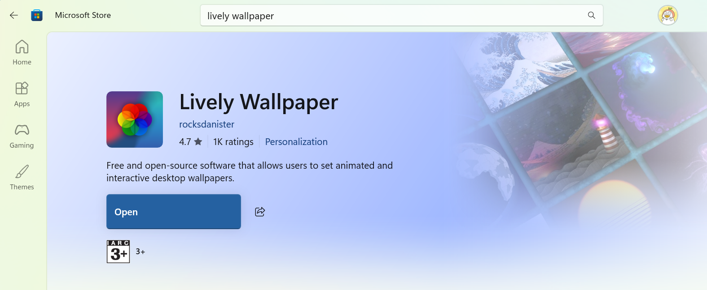
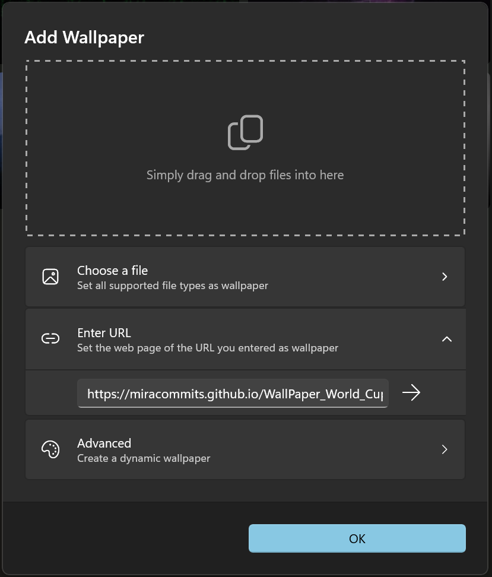
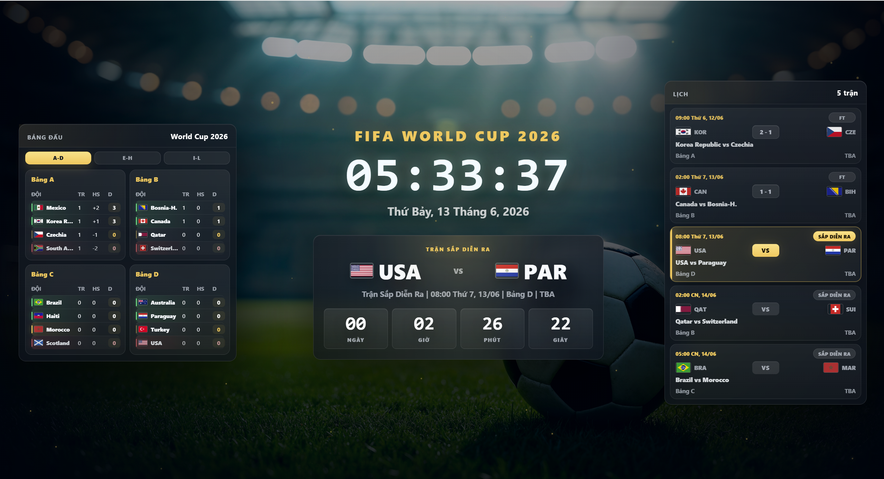

# World Cup 2026 Live Wallpaper

Một wallpaper động dành cho **FIFA World Cup 2026**, hiển thị đồng hồ, lịch thi đấu, tỉ số, bảng xếp hạng vòng bảng và trạng thái các trận đấu theo thời gian thực. Giao diện được thiết kế theo phong cách broadcast overlay: tối, gọn, nổi bật thông tin quan trọng nhưng không gây rối mắt.

<!--
Bạn có thể chèn ảnh demo thủ công tại đây, ví dụ:


-->

## Điểm nổi bật

- **Đồng hồ trung tâm** với ngày giờ theo múi giờ Việt Nam.
- **Đếm ngược trận sắp diễn ra** với cờ, tên đội, bảng đấu và sân thi đấu.
- **Lịch thi đấu bên phải** hiển thị trận đã kết thúc, trận đang diễn ra và trận sắp tới.
- **Bảng xếp hạng bên trái** tự tính điểm từ dữ liệu trận đấu.
- **Highlight thông minh**:
  - Top 1–2 mỗi bảng: tạm vào vòng 32.
  - 8 đội hạng ba tốt nhất: tạm vào vòng 32.
  - Đội cuối bảng: cảnh báo loại bằng màu đỏ nhẹ.
- **Hình nền sân vận động xoay tự động** theo thời gian cấu hình.
- **Tương thích GitHub Pages và Lively Paper/Lively Wallpaper**, không cần bật server local liên tục.

## Cách hoạt động

Dự án sử dụng chế độ cập nhật dữ liệu qua GitHub Actions để tránh lỗi CORS khi gọi API trực tiếp từ trình duyệt.

Luồng hoạt động:

```text
football-data.org
        ↓
GitHub Actions
        ↓
data.json / data.js
        ↓
GitHub Pages
        ↓
Lively Paper / trình duyệt
```

Frontend chỉ đọc file tĩnh `data.json`, vì vậy có thể chạy ổn định trên GitHub Pages hoặc trong ứng dụng wallpaper mà không cần backend riêng.

## Cấu trúc chính

```text
.github/workflows/update-football-data.yml
scripts/update-data.js
index.html
app.js
config.js
data.json
data.js
styles.css
assets/
```

Trong đó:

- `app.js`: xử lý giao diện, countdown, lịch đấu và bảng xếp hạng.
- `styles.css`: giao diện wallpaper.
- `config.js`: cấu hình API mode, thời gian refresh, hình nền.
- `data.json`: dữ liệu được GitHub Actions cập nhật.
- `data.js`: dữ liệu fallback cho lần tải đầu hoặc khi không đọc được `data.json`.
- `.github/workflows/update-football-data.yml`: workflow tự động lấy dữ liệu mới.

## Cài đặt nhanh

Clone hoặc tải source code về máy:

```bash
git clone https://github.com/MiraCommits/WallPaper_World_Cup_2026.git
cd WallPaper_World_Cup_2026
```

## Cấu hình GitHub Secret

Dự án cần token từ football-data.org để GitHub Actions có thể lấy dữ liệu.

Vào repository trên GitHub:

```text
Settings → Secrets and variables → Actions → New repository secret
```

Tạo secret:

```text
Name: FOOTBALL_DATA_TOKEN
Value: token football-data.org của bạn
```

Không đưa token vào `config.js`, `app.js` hoặc bất kỳ file frontend nào.

## Bật GitHub Pages

Vào:

```text
Repository Settings → Pages
```

Chọn:

```text
Source: Deploy from a branch
Branch: main
Folder: /root
```

Sau khi bật, trang sẽ có dạng:

```text
https://miracommits.github.io/WallPaper_World_Cup_2026/```

## Cập nhật dữ liệu tự động

Workflow GitHub Actions sẽ đọc API, tạo lại `data.json` và `data.js`, sau đó commit dữ liệu mới về repository.

Bạn có thể chạy thủ công lần đầu tại:

```text
Actions → Update football-data.org data → Run workflow
```

Nếu muốn cập nhật thường xuyên hơn, có thể dùng:

- GitHub Actions `schedule`
- hoặc dịch vụ cron bên ngoài gọi `workflow_dispatch`

## Sử dụng với Lively Paper / Lively Wallpaper

Bạn có thể dùng wallpaper này trực tiếp bằng URL GitHub Pages.

Các bước cơ bản:

1. Cài ứng dụng **Lively Paper** hoặc **Lively Wallpaper** từ Store.
2. Mở ứng dụng.
3. Chọn thêm wallpaper mới từ URL hoặc webpage.
4. Dán URL GitHub Pages của dự án:

```text
https://miracommits.github.io/WallPaper_World_Cup_2026/
```

5. Lưu wallpaper và đặt làm hình nền.

Bạn có thể chèn ảnh hướng dẫn thủ công tại đây, ví dụ:
### Tải ứng dụng Lively Wallpaper



### Thêm wallpaper trong Lively



### Wallpaper sau khi chạy



Lưu ý:

- Không dùng `localhost` nếu muốn wallpaper chạy ổn định lâu dài.
- Không cần bật Live Server hoặc Node server nếu đã dùng GitHub Pages.
- Dữ liệu sẽ được frontend đọc lại theo `REFRESH_INTERVAL` trong `config.js`.

## Cấu hình hình nền

Trong `config.js`, bạn có thể chỉnh danh sách hình nền:

```js
BACKGROUND_IMAGES: [
  "./assets/1.jpg",
  "./assets/2.jpg",
  "./assets/3.jpg"
]
```

Thời gian đổi hình nền:

```js
BACKGROUND_INTERVAL: 30 * 60 * 1000
```

Ví dụ trên nghĩa là đổi hình nền mỗi 30 phút.

## Cấu hình refresh dữ liệu

Trong `config.js`:

```js
REFRESH_INTERVAL: 5 * 60 * 1000
```

Giá trị trên nghĩa là frontend sẽ đọc lại `data.json` mỗi 5 phút.

## Quy tắc tính điểm vòng bảng

Mỗi trận vòng bảng được tính như sau:

```text
Thắng: 3 điểm
Hòa:   1 điểm
Thua:  0 điểm
```

Sau vòng bảng:

- Hai đội đứng đầu mỗi bảng vào vòng 32.
- Tám đội xếp thứ ba có thành tích tốt nhất cũng vào vòng 32.
- Các đội còn lại bị loại.

Bảng xếp hạng được sắp xếp theo:

```text
Điểm → Hiệu số → Bàn thắng → Mã đội
```

## Tùy biến giao diện

Bạn có thể chỉnh màu chính trong `styles.css`:

```css
:root {
  --gold: #f7c85f;
  --green: #45d483;
  --red: #ff6b6b;
}
```

Gợi ý:

- `--gold`: trận sắp diễn ra, tab active, tiêu đề.
- `--green`: trận LIVE hoặc đội đang nằm trong nhóm đi tiếp.
- `--red`: đội đang bị loại.
- `--muted`: thông tin phụ.

## Ghi chú

Dự án này được thiết kế để chạy tốt trên màn hình desktop/wallpaper. Khi dùng trên màn hình nhỏ, layout sẽ tự chuyển thành dạng dọc để dễ xem hơn.

Nếu dữ liệu chưa cập nhật ngay, hãy kiểm tra:

1. GitHub Actions có chạy thành công không.
2. `data.json` trên GitHub Pages đã thay đổi chưa.
3. Trình duyệt hoặc Lively có đang cache file cũ không.
4. Version query trong `index.html` đã được tăng chưa, ví dụ `app.js?v=30`.

## License

Dự án dành cho mục đích cá nhân và học tập. Bạn có thể tùy chỉnh giao diện, hình nền và logic hiển thị theo nhu cầu riêng.
